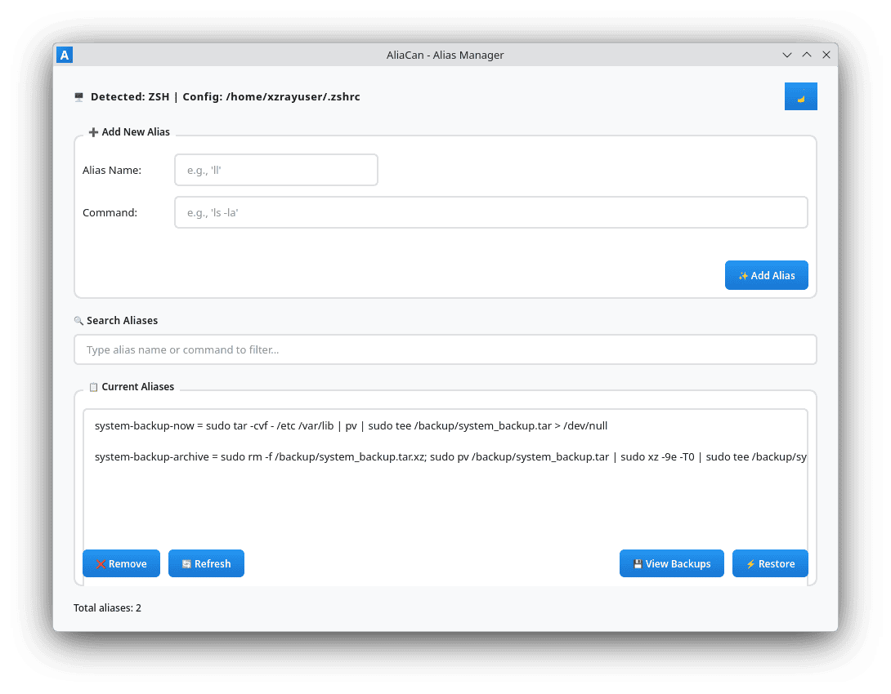

# AliaCan - Shell Alias Manager with Auto-Backup


A powerful, user-friendly shell alias manager for Linux with automatic backups, cross-shell support, and a modern Qt6 GUI. Manage your bash, zsh, and fish aliases effortlessly!



## Features
✨ **Core Features**
- 🔍 **Auto Shell Detection** - Detects bash, zsh, or fish automatically
- 📝 **Easy Alias Management** - Add, edit, and remove aliases via intuitive GUI
- 💾 **Automatic Backups** - Timestamps all backups before modifications
- ↩️ **Restore Backups** - Roll back to previous alias configurations instantly
- 🔒 **Safe Operations** - Input validation and permission checking
- ⚡ **Real-time Sync** - Changes apply immediately to config files
- 🎨 **Modern UI** - Beautiful Qt6 interface with dark/light theme support

🛡️ **Security & Reliability**
- File permission validation (644 mode)
- Input sanitization and validation
- Atomic file operations
- Error handling and recovery

🚀 **Performance**
- Lightweight C++23 implementation
- Minimal resource footprint
- Fast alias parsing and loading
- Optimized backup management


## Requirements

### Build Dependencies
- C++23 compatible compiler (GCC 13+, Clang 16+)
- CMake 3.28+
- Qt6 (Core, Gui, Widgets)
- Linux kernel 5.10+

### Runtime Dependencies
- glibc 2.33+
- Qt6 libraries
- POSIX-compliant shell (bash, zsh, or fish)

### Supported Linux Distributions
- **Arch Linux** (optimized primary target)
- **Fedora** 38+
- **Ubuntu** 22.04 LTS+
- **Debian** 12+
- **openSUSE** Leap 15.5+
- **Alpine Linux** 3.17+
- All other POSIX-compliant Linux distributions


## Installation

### From Source (Development)

1. **Clone or download the repository**

```bash
git clone https://github.com/alia-can/alia-can.git
cd alia-can
```

2. **Install dependencies**
   
**Arch Linux:**

```bash
sudo pacman -S base-devel cmake qt6-base clang
```

**Fedora:**

```bash
sudo dnf install gcc-c++ cmake qt6-qtbase-devel clang
```

**Ubuntu/Debian:**

```bash
sudo apt install build-essential cmake qt6-base-dev clang-14
```

3. **Build the project**

```bash
mkdir build
cd build
cmake ..
cmake --build . -j$(nproc)
```

4. **Install binary**

```bash
sudo cmake --install . --config Release
# Or manually:
sudo install -Dm755 alia-can /usr/local/bin/alia-can
```

5. **Launch Application**

```bash
alia-can
```


## Uninstallation

### From Source

```bash
cd build
sudo cmake --build . --target uninstall
# Or manually:
sudo rm /usr/local/bin/alia-can
```


### GUI Usage
1. **Launch** the application
2. **View** your current shell and config file path in the header
3. **Add Aliases** using the input fields and "Add Alias" button
4. **Remove Aliases** by selecting from the list and clicking "Remove Selected"
5. **View Backups** to see all previous configurations
6. **Restore Backups** to recover previous alias sets


### Test Coverage
- ✅ Shell detection and path expansion
- ✅ Alias name/command validation
- ✅ Alias parsing from config files
- ✅ File I/O operations
- ✅ Backup creation and restoration
- ✅ Error handling and recovery


## Security Considerations
1. **File Permissions**: Config files use 644 (rw-r--r--) permissions
2. **Input Validation**: All alias names and commands are validated
3. **No Privilege Escalation**: Application runs with user privileges
4. **Backup Integrity**: Automatically backup config file
5. **Configuration Privacy**: No network operations, purely local


## FAQ

**Q: Will AliaCan overwrite my existing config files?**

A: No. AliaCan only appends new aliases and removes specific lines. It creates backups before all modifications.

**Q: Can I use AliaCan with multiple shells?**

A: Yes! AliaCan detects your current shell and manages its config file. You can switch shells and manage each independently.

**Q: Are backups automatic?**

A: Yes! AliaCan creates timestamped backups before every add/remove operation.

**Q: Can I restore to any backup, not just the most recent?**

A: Yes! Use the "View Backups" dialog to see and restore from any backup.

**Q: Will my aliases work after restore?**

A: Yes, but you need to reload your shell config: `source ~/.bashrc` or open a new terminal.


## License
MIT License - See LICENSE file for details


## Support
- 📧 Email:  ardiansyahfahri024@gmail.com
- 🐛 Issues: [GitHub Issues](https://github.com/alia-can/alia-can/issues)
- 💬 Discussions: [GitHub Discussions](https://github.com/alia-can/alia-can/discussions)


## Credits

Developed with ❤️ for Linux users who love their shell aliases.

-----------------------------------------------------------------------------

**Made with C++23 and Qt6** • **Cross-platform • Open Source • Free Forever**
